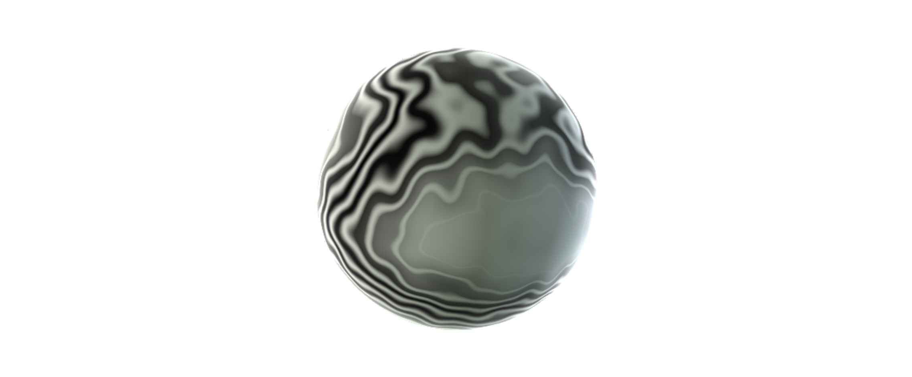

# Three.js Material Experiments

These are material sketches. Some are part of my 2017 daily project. Branches
that fit the pattern `ig-2017-XX-XX` are a specific post from that project.

## Install

```bash
npm i
```

## Run

```
npm start
```

## Technologies Used

- [three.js](http://threejs.org)
- [glslify](https://github.com/stackgl/glslify)
